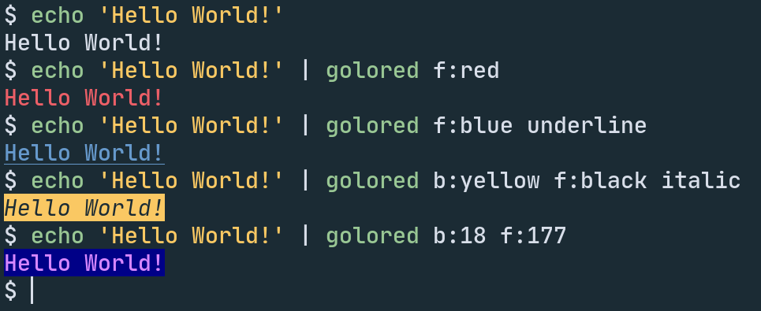

# golored

[](https://github.com/alexcoder04/golored/releases/latest)
[](https://aur.archlinux.org/packages/golored)
[](https://github.com/alexcoder04/golored/search?l=go)
[](https://github.com/alexcoder04/golored/blob/main/LICENSE)
[](https://github.com/alexcoder04/golored/issues)
[](https://github.com/alexcoder04/golored/pulls)

Simply color your shell scripts' output by piping it into this program.

If you are intereseted in a more lightweight but also less-features version written in Shell, see [alexcoder04/shclrz](https://github.com/alexcoder04/shclrz).



## Installation

### Arch Linux

Golored is available on the [AUR](https://aur.archlinux.org/packages/golored).
Either install it manually or use an AUR helper of your choice.

### Pre-built binaries

Download the corresponding binary for your system from the [releases page](https://github.com/alexcoder04/golored/releases/latest).

### Build from source

```sh
git clone https://github.com/alexcoder04/golored.git
cd golored
make build   # to compile
make install # to install the binary to your $GOPATH
```

## Usage

> `golored [-s SOURCE_FILE] formatting...`

> `golored [-help / -i / -ii]`

| argument         | function                           |
|------------------|------------------------------------|
| `-help`          | print help                         |
| `-i`             | print color codes                  |
| `-ii`            | print extended color codes (8-bit) |
| `-s SOURCE_FILE` | read from file                     |

### Examples:

```sh
golored -s file.txt f:red underline
```

Outputs the content of `file.txt` underlined and with red foreground.

```
ls | golored b:blue
```

Colors the output of `ls` with blue background.

### List of colors:

`black`, `blue`, `red`, `magenta`, `green`, `cyan`, `yellow`, `white`

`0`-`255` (8-bit, use `-ii` flag to see how they look)

Prepend with `f:` to specify the foreground and with `b:` for background.

### List of formatting options:

`bold`, `dim`, `italic`, `underline`

